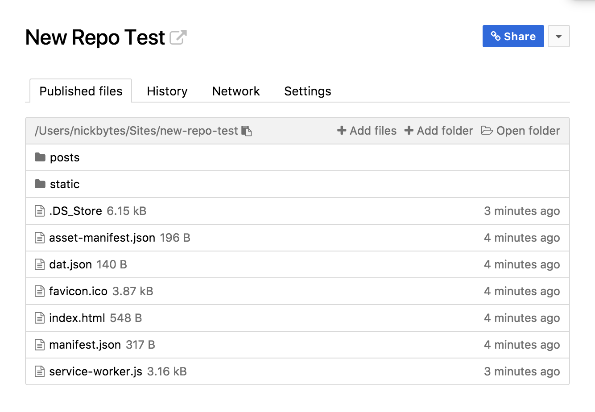

# xXx\_\_\_dead\_\_\_xXx


## What is _dead_?

_Dead_ is a blogging/tumblog/content manufacturing device built using [dat](https://datproject.org/) and running on [beaker browser](https://beakerbrowser.com/). Have you heard of tumblr before? Then you get it.

The key difference, though, is that by running on the dat protocol, _dead_ enables each individual to create their own instance of _dead_ and to publish their own content on their own computer and share to other people who have their own _dead_ instances. This means the data lives on your computer and doesn't _require_ any server space.

We will have more info as the project progresses about features and hot tips on how to make _dead_ more personalized.

## Development

_dead_ is still heavily in development, but we encourage people to jump on and give it a try. Feeling really ambitious? Jump in the code base and give us a good ole' PR. _dead_ will never make any of us a dime so, like, the free labor probably won't be that exploited.

1.  Clone the repo.
2.  Install dependencies

```bash
yarn install
```

3.  Start the development server

```bash
yarn start
```

4.  Create a new Dat site in your Beaker Browser library.
5.  Add your Dat url to config.js
6.  Replace the contents of `dat.json` with your new `dat.json`
7.  Run a build in a separate window

```bash
yarn run build
```

8.  Add the _contents_ from your `/build` folder to your new site's library. The output should look something like this:



9.  You should be able to navigate to your localhost address now, and still pull posts/data from your dat site.
